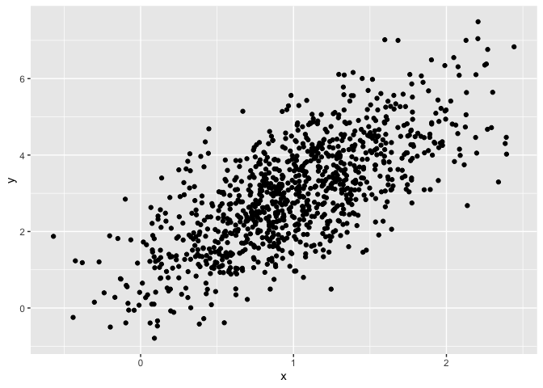
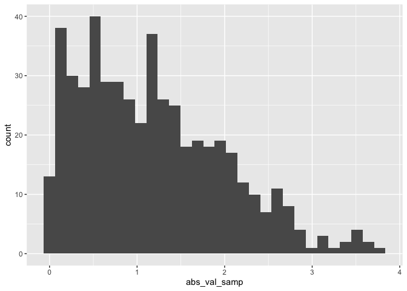

Simple document
================
Ruohan Lyu
2025-09-09

I’m an R Markdown document!

``` r
library(tidyverse)
```

# Section 1

Here’s a **code chunk** that samples from a *normal distribution*:

``` r
samp = rnorm(100) # generate 100 random numbers from normal distribution
length(samp) # return to the number of elements
```

    ## [1] 100

# Section 2

I can take the mean of the sample, too! The mean is -0.0102661.

# Section 3

This is where I’m going to talk about code chunks.

``` r
mean(samp)
sd(samp)
```

Let’s also make a dataframe.

``` r
example_df =
   tibble(
     vec_numeric = 1:4,
     vec_char = c("My","name","is","Hannah"),
     vec_factor = factor(c("male","male","female","female"))
   )
```

Let’s make a plot and see how cool it is!

``` r
plot_df =
  tibble(
    x = rnorm(1000, mean = 1, sd = .5),
    y = 1 + 2 * x + rnorm(1000)
  )

ggplot(plot_df, aes(x = x, y = y)) + geom_point()
```

<!-- -->

This is a neat scatterplot!

# Learning Assessment

The chunk below creates a dataframe containing a sample of size 500 from
a random normal variable, constructs the specified logical vector, takes
the absolute value of each element of that sample, and produces a
histogram of the absolute value. The code chunk also finds the median of
the sample and stores it for easy in-line printing.

``` r
la_df = 
  tibble(
    numeric_samp = rnorm(500, mean = 1),
    greater_0 = numeric_samp > 0,
    abs_val_samp = abs(numeric_samp)
)

ggplot(la_df, aes(x = abs_val_samp)) + geom_histogram()
```

    ## `stat_bin()` using `bins = 30`. Pick better value with `binwidth`.

<!-- -->

inline code:

The sample size in the new dataframe is 500.

The median of the variable containing absolute values is 1.

If I want to talk about `la_df`, i would use the backticks.

# Let’s look at formatting

All of this is markdown formatting.

## Text formatting

*italic* or *italic*  
**bold** or **bold**  
`code`  
superscript<sup>2</sup> and subscript<sub>2</sub>

## Headings

# 1st Level Header

## 2nd Level Header

### 3rd Level Header

## Lists

- Bulleted list item 1

- Item 2

  - Item 2a

  - Item 2b

1.  Numbered list item 1

2.  Item 2. The numbers are incremented automatically in the output.

## Tables

| First Header | Second Header |
|--------------|---------------|
| Content Cell | Content Cell  |
| Content Cell | Content Cell  |
